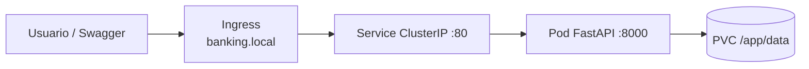

# Trabajo K8S — Core Banking Lite

Microservicio bancario desplegado con: **Docker → Helm → Kubernetes → ArgoCD → GitHub Actions**.

Simula operaciones de un banco (clientes, cuentas, transacciones en COP) sin base de datos — los datos viven en archivos JSON montados en un **PVC** dentro del cluster.

**Autores:** Jorge Eliecer Rojas, Juan Esteban Gomez, Fabian Andres Rojas, Juan Velez, David Panesso  
**Curso:** Arquitectura de Software — Universidad de La Sabana

---

## Que es esto

Es un backend estilo banco con API REST y Swagger. Cuando alguien hace push a `main`, GitHub Actions construye la imagen Docker, actualiza Helm y ArgoCD despliega solo en Kubernetes.

No usamos PostgreSQL ni nada parecido. La persistencia es local (JSON) pero en K8S va en un volumen persistente para que los datos no se pierdan si el pod se reinicia.

---

## Arquitectura hexagonal

Separamos el codigo en capas para que el dominio no dependa de FastAPI ni de donde se guardan los datos:

```
app/
├── domain/              Entidades, enums, excepciones, ports (interfaces)
├── application/         Casos de uso (logica de negocio)
├── infrastructure/
│   ├── persistence/     Repositorios JSON
│   ├── seed/            Datos de ejemplo al primer arranque
│   └── web/             Routers FastAPI, schemas, mappers
└── main.py              Punto de entrada (composition root)
```

**Flujo:** Router → Caso de uso → Repositorio → archivo JSON

---

## Modulos de la API

Swagger completo en `/docs` (probar ahi primero).

### Clientes — `/api/v1/clientes`

| Metodo | Ruta | Descripcion |
|--------|------|-------------|
| POST | `/clientes` | Crear cliente |
| GET | `/clientes` | Listar (paginado) |
| GET | `/clientes/{id}` | Detalle |
| PATCH | `/clientes/{id}` | Actualizar nombre/email |

### Cuentas — `/api/v1/cuentas`

| Metodo | Ruta | Descripcion |
|--------|------|-------------|
| POST | `/cuentas` | Abrir cuenta (ahorros o corriente) |
| GET | `/cuentas` | Listar (filtro por `cliente_id`) |
| GET | `/cuentas/{id}` | Detalle + saldo |
| PATCH | `/cuentas/{id}/estado` | Activar / bloquear / cerrar |

### Transacciones — `/api/v1/transacciones`

| Metodo | Ruta | Descripcion |
|--------|------|-------------|
| POST | `/transacciones/consignacion` | Ingresar dinero |
| POST | `/transacciones/retiro` | Retirar (valida saldo) |
| POST | `/transacciones/transferencia` | Entre dos cuentas |
| GET | `/transacciones` | Historial (filtros) |
| GET | `/transacciones/{id}` | Detalle |

Transferencias aceptan header opcional `X-Idempotency-Key` para no duplicar la misma operacion.

### Sistema

| Metodo | Ruta | Descripcion |
|--------|------|-------------|
| GET | `/` | Info del servicio |
| GET | `/health` | Health check (K8S probes) |
| GET | `/info` | Runtime + ruta de datos |
| GET | `/docs` | Swagger UI |

---

## Reglas de negocio

- Montos en **COP**, sin saldo negativo
- Cuentas **bloqueadas** o **cerradas** no mueven dinero
- Transferencias debitan origen y acreditan destino juntos
- Documento de cliente unico (no duplicados)
- Al primer arranque carga **datos seed** (2 clientes, 3 cuentas) para probar rapido

IDs seed utiles en Swagger:
- Cliente: `seed-cliente-001`
- Cuentas: `seed-cuenta-001`, `seed-cuenta-002`, `seed-cuenta-003`

---

## Estructura del repo

```
mi-microservicio/
├── app/                         Codigo fuente (hexagonal)
├── requirements.txt
├── Dockerfile
├── helm/mi-microservicio/
│   ├── values.yaml              Config + PVC
│   ├── values-prod.yaml         Override manual (ArgoCD no lo usa)
│   └── templates/
│       ├── deployment.yaml
│       ├── service.yaml
│       ├── ingress.yaml         Entrada HTTP (tipo produccion)
│       └── pvc.yaml             Volumen persistente para /app/data
├── argocd/application.yaml
└── .github/workflows/ci.yml
```

---

## Probar en local (sin K8S)

Desde la raiz del repo:

```powershell
cd app
python -m venv .venv
.venv\Scripts\activate
pip install -r ..\requirements.txt
$env:DATA_DIR = "..\data"
uvicorn main:app --reload --port 8000
```

Abrir `http://localhost:8000/docs`

Los JSON se guardan en `./data/` (ignorado por git).

---

## Docker local

```powershell
docker build -t mi-microservicio:local .
docker run -p 8000:8000 -v ${PWD}/data:/app/data mi-microservicio:local
```

---

## Kubernetes con Minikube (acceso tipo produccion)

En produccion el usuario no usa `port-forward`. El trafico entra por un **Ingress** que apunta al **Service**, y el Service solo manda trafico a pods que pasan `/health`.



**Ventaja:** cuando ArgoCD despliega una version nueva, el Ingress sigue apuntando al Service. Cuando el pod nuevo esta listo, el trafico cambia solo. **No hay que reiniciar nada en tu PC** (a diferencia del port-forward).

### 1. Arrancar cluster

```powershell
minikube start
```

### 2. Habilitar Ingress (solo la primera vez)

```powershell
minikube addons enable ingress
kubectl get pods -n ingress-nginx
```

Espera que el controller nginx este `Running`.

### 3. Instalar / actualizar con Helm

```powershell
helm upgrade --install mi-microservicio ./helm/mi-microservicio `
  --namespace mi-microservicio --create-namespace
```

Crea: Deployment, Service, Ingress y PVC.

```powershell
kubectl get pods,ingress,pvc -n mi-microservicio
```

### 4. Configurar el host local (solo una vez)

Obtener IP de Minikube:

```powershell
minikube ip
```

Agregar en `C:\Windows\System32\drivers\etc\hosts` (como administrador):

```
<IP_DE_MINIKUBE>  banking.local
```

Ejemplo: `192.168.49.2  banking.local`

### 5. Abrir la API

Swagger: **http://banking.local/docs**

```powershell
curl http://banking.local/health
curl http://banking.local/api/v1/clientes
```

Tras un deploy de ArgoCD, solo recarga el navegador (`Ctrl + Shift + R`). El Ingress no se cae como el port-forward.

---

### Port-forward (solo debug, no es produccion)

Util si no quieres tocar el archivo hosts:

```powershell
kubectl port-forward svc/mi-microservicio-mi-microservicio 8080:80 -n mi-microservicio
```

Swagger: `http://localhost:8080/docs`

> **Ojo:** el port-forward se engancha a un pod concreto. Si ArgoCD reinicia el pod, **se corta** y hay que ejecutarlo otra vez. Por eso en prod se usa Ingress.

---

### Despliegue sin caida total (rolling update)

El chart usa:

```yaml
strategy:
  rollingUpdate:
    maxSurge: 0
    maxUnavailable: 1
```

Con **1 replica + PVC ReadWriteOnce** no podemos tener dos pods montando el mismo disco. Kubernetes reemplaza el pod de forma controlada y el `preStop` espera 5s antes de apagarlo.

Puede haber **unos segundos** sin respuesta durante el cambio. Eso es normal con JSON en un solo volumen. En un banco real usarias **base de datos + varias replicas** para cero downtime.

---

## ArgoCD (GitOps)

Igual que antes — ArgoCD vigila el repo y sincroniza cuando cambia `values.yaml` (incluido el tag de la imagen que actualiza el CI).

```powershell
kubectl apply -f ./argocd/application.yaml
```

Estados esperados: **Synced** + **Healthy**

---

## CI/CD (GitHub Actions)

Push a `main` → build imagen → push a `ghcr.io` → commit del nuevo tag en `values.yaml` → ArgoCD despliega.

El commit del CI lleva `[skip ci]` para no entrar en loop.

---

## Persistencia (PVC)

Los archivos viven en `/app/data/` dentro del contenedor:

```
clientes.json
cuentas.json
transacciones.json
```

Con PVC los datos **sobreviven** reinicios del pod. Sin PVC (solo local) se pierden al borrar el contenedor.

> Nota: el PVC es `ReadWriteOnce`, o sea **1 replica**. Si subes replicas en prod, cada pod necesitaria su propio volumen o una BD real.

---

## values-prod.yaml

Override manual para probar mas recursos y `APP_ENV=production`. **ArgoCD no lo carga** — solo `values.yaml`.

```powershell
helm upgrade --install mi-microservicio ./helm/mi-microservicio `
  -f helm/mi-microservicio/values.yaml `
  -f helm/mi-microservicio/values-prod.yaml `
  --namespace mi-microservicio
```

---

## Ejemplos rapidos (curl)

Con Ingress (recomendado):

```powershell
curl http://banking.local/api/v1/clientes
curl http://banking.local/api/v1/cuentas/seed-cuenta-001
curl -X POST http://banking.local/api/v1/transacciones/transferencia `
  -H "Content-Type: application/json" `
  -d '{"cuenta_origen_id":"seed-cuenta-001","cuenta_destino_id":"seed-cuenta-002","monto":50000}'
```

Con port-forward (si usas localhost:8080):

```powershell
curl http://localhost:8080/api/v1/clientes
```

---

## Comandos utiles

```powershell
kubectl get pods,ingress -n mi-microservicio
kubectl logs -n mi-microservicio -l app.kubernetes.io/name=mi-microservicio
helm upgrade mi-microservicio ./helm/mi-microservicio --namespace mi-microservicio
minikube ip
```

Debug con port-forward (opcional):

```powershell
kubectl port-forward svc/mi-microservicio-mi-microservicio 8080:80 -n mi-microservicio
```

---

## Errores comunes de la API

| Codigo | Significado |
|--------|-------------|
| 404 | Cliente, cuenta o transaccion no existe |
| 409 | Documento duplicado o idempotency key repetida |
| 422 | Saldo insuficiente |
| 400 | Cuenta bloqueada/cerrada u otra regla de negocio |

Respuesta tipo: `{"code": "saldo_insuficiente", "message": "..."}`
