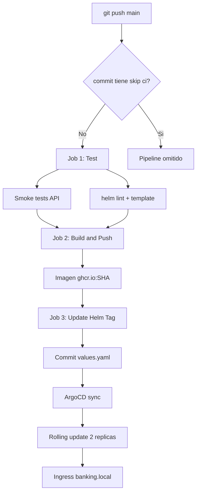

# Trabajo K8S — Core Banking Lite

Microservicio bancario desplegado con: **Docker → Helm → Kubernetes → ArgoCD → GitHub Actions**.

Simula un banco (clientes, cuentas, transacciones en COP). **Stateless**: datos en memoria, pensado para CI/CD, rolling update y varias replicas sin pelear por discos.

**Autores:** Jorge Eliecer Rojas, Juan Esteban Gomez, Fabian Andres Rojas, Juan Velez, David Panesso  
**Curso:** Arquitectura de Software — Universidad de La Sabana

---

## Que es esto

Backend bancario con API REST y Swagger. Push a `main` dispara un pipeline que:

1. Ejecuta **tests** y valida el chart Helm
2. Construye y publica la **imagen Docker** en ghcr.io
3. Actualiza el **tag** en `values.yaml`
4. **ArgoCD** despliega en Kubernetes con rolling update (sin tumbar todo)

---

## Pipeline CI/CD completo



| Job | Que hace |
|-----|----------|
| **Test** | `/health`, clientes seed, transferencia de prueba, `helm lint` |
| **Build & Push** | Docker build → `ghcr.io/usuario/mi-microservicio:SHA` |
| **Update Helm Tag** | Commit automatico del tag en `values.yaml` con `[skip ci]` |

Disparo manual: pestaña **Actions** → **Run workflow** (`workflow_dispatch`).

---

## Arquitectura hexagonal

```
app/
├── domain/              Entidades, enums, excepciones, ports
├── application/         Casos de uso
├── infrastructure/
│   ├── persistence/     Repositorios en memoria
│   ├── seed/            Datos de ejemplo al arrancar cada pod
│   └── web/             FastAPI (routers, schemas)
└── main.py
```

**Flujo:** Router → Caso de uso → Repositorio en memoria

---

## Modulos de la API

Swagger en `/docs`.

### Clientes — `/api/v1/clientes`

| Metodo | Ruta | Descripcion |
|--------|------|-------------|
| POST | `/clientes` | Crear cliente |
| GET | `/clientes` | Listar (paginado) |
| GET | `/clientes/{id}` | Detalle |
| PATCH | `/clientes/{id}` | Actualizar nombre/email |

### Cuentas — `/api/v1/cuentas`

| Metodo | Ruta | Descripcion |
|--------|------|-------------|
| POST | `/cuentas` | Abrir cuenta (ahorros o corriente) |
| GET | `/cuentas` | Listar (filtro por `cliente_id`) |
| GET | `/cuentas/{id}` | Detalle + saldo |
| PATCH | `/cuentas/{id}/estado` | Activar / bloquear / cerrar |

### Transacciones — `/api/v1/transacciones`

| Metodo | Ruta | Descripcion |
|--------|------|-------------|
| POST | `/transacciones/consignacion` | Ingresar dinero |
| POST | `/transacciones/retiro` | Retirar (valida saldo) |
| POST | `/transacciones/transferencia` | Entre dos cuentas |
| GET | `/transacciones` | Historial (filtros) |
| GET | `/transacciones/{id}` | Detalle |

### Sistema

| Metodo | Ruta | Descripcion |
|--------|------|-------------|
| GET | `/` | Info del servicio |
| GET | `/health` | Health check (K8S probes) |
| GET | `/info` | Runtime del pod |
| GET | `/docs` | Swagger UI |

IDs seed: `seed-cliente-001`, `seed-cuenta-001`, `seed-cuenta-002`, `seed-cuenta-003`

---

## Stateless (sin JSON ni PVC)

- Cada pod tiene su **propia memoria** con datos seed al arrancar
- Al hacer deploy los datos **no persisten** (como muchos servicios stateless de verdad)
- Ventaja: **2 replicas**, rolling update `maxSurge: 1` / `maxUnavailable: 0` → casi sin corte
- En un banco real el siguiente paso seria PostgreSQL; aqui priorizamos el flujo DevOps

---

## Estructura del repo

```
mi-microservicio/
├── app/
├── Dockerfile
├── helm/mi-microservicio/
│   ├── values.yaml
│   └── templates/
│       ├── deployment.yaml
│       ├── service.yaml
│       └── ingress.yaml
├── argocd/application.yaml
└── .github/workflows/ci.yml
```

---

## Probar en local

```powershell
cd app
python -m venv .venv
.venv\Scripts\activate
pip install -r ..\requirements.txt
uvicorn main:app --reload --port 8000
```

`http://localhost:8000/docs`

---

## Kubernetes con Minikube

### 1. Cluster + Ingress

```powershell
minikube start
minikube addons enable ingress
```

### 2. Helm

```powershell
helm upgrade --install mi-microservicio ./helm/mi-microservicio `
  --namespace mi-microservicio --create-namespace
```

Verificar 2 replicas:

```powershell
kubectl get pods -n mi-microservicio
```

### 3. Hosts

`minikube ip` → agregar en `C:\Windows\System32\drivers\etc\hosts`:

```
<IP>  banking.local
```

### 4. Swagger

**http://banking.local/docs**

Tras un deploy de ArgoCD solo recarga el navegador. El Ingress no se cae como el port-forward.

---

## ArgoCD

```powershell
kubectl apply -f ./argocd/application.yaml
```

Estado esperado: **Synced** + **Healthy**

---

## Version de la app

| Donde | Para que |
|-------|----------|
| `values.yaml` → `env.APP_VERSION` | Swagger + `/info` en el cluster |
| `helm/.../Chart.yaml` → `appVersion` | Metadata del chart |
| `image.tag` en `values.yaml` | Lo actualiza el **CI** (SHA del commit) — no tocar a mano |

---

## Comandos utiles

```powershell
kubectl get pods,ingress -n mi-microservicio
kubectl logs -n mi-microservicio -l app.kubernetes.io/name=mi-microservicio --tail=50
helm upgrade mi-microservicio ./helm/mi-microservicio --namespace mi-microservicio
curl http://banking.local/health
```

---

## Errores comunes

| Codigo | Significado |
|--------|-------------|
| 404 | Recurso no existe |
| 409 | Documento duplicado o idempotency key repetida |
| 422 | Saldo insuficiente |
| 400 | Cuenta bloqueada/cerrada |

Si el pipeline falla en **Test**, no se publica imagen. Revisa la pestaña Actions en GitHub.
